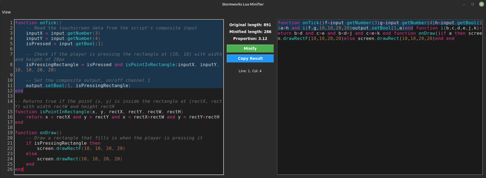
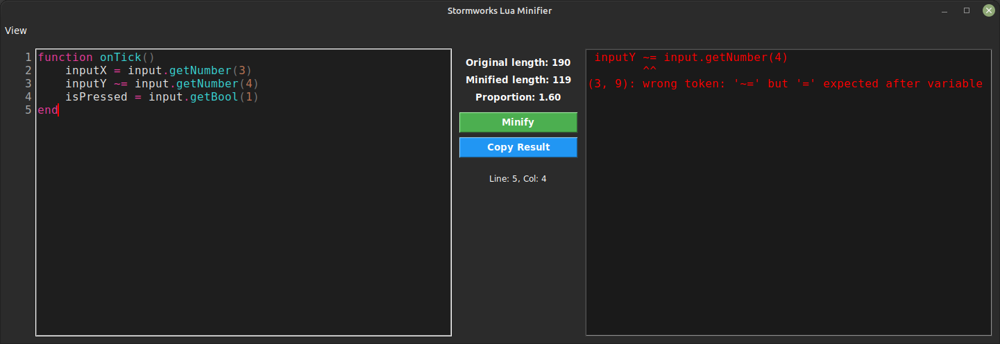
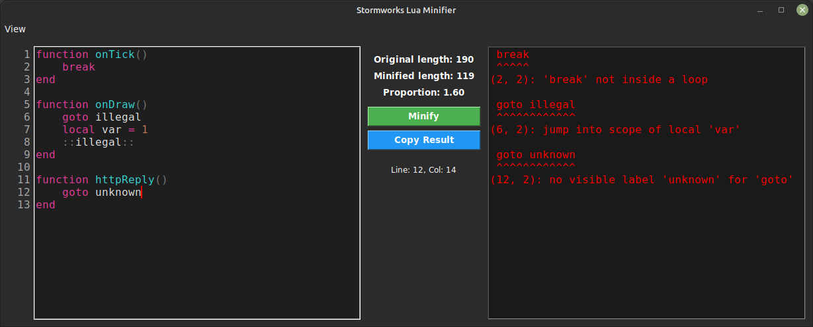
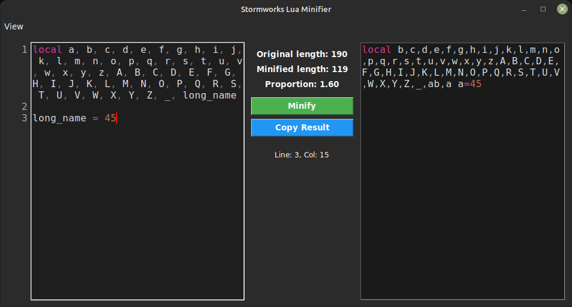

# Lua minifier for stormworks

My simple tool to minify lua scripts when 8k symbols is not enought. Works both on Windows and Linux.

## Features
### Examine the source of minified segments
Clicking on minified text fragments highlights their source


### Verbose error messages
Easier to locate and fix typos

Including errors with loops and gotos


### Optimal renaming strategy
Consider the following fragment
```lua
local a, b, c, d, e, f, g, h, i, j, k, l, m, n, o, p, q, r, s, t, u, v, w, x, y, z, A, B, C, D, E, F, G, H, I, J, K, L, M, N, O, P, Q, R, S, T, U, V, W, X, Y, Z, _, long_name

long_name = 45
```

Tools that do not utilize an optimal strategy would still assign a longer identifier to 'long_name'.
For example, the output from PonyIDE could illustrate this:
```lua
local a,b,c,d,e,f,g,h,i,j,k,l,m,n,o,p,q,r,s,t,u,v,w,x,y,z,A,B,C,D,E,F,G,H,I,J,K,L,M,N,O,P,Q,R,S,T,U,V,W,X,Y,Z,_,a0
a0=45
```
which is **121** symbols. This utility ensures that the more frequently a character is used, the shorter its identifier will be.
Previous example now evaluates to **119** symbols:


---

## Requirements

- Python 3.11+
- Tkinter (usually included by default in Python installations)

No additional libraries or packages are required.

---

## Installation & Running

### Windows

You have two options to run the app on Windows:

1. Using Python directly  
   - If Python 3.11+ is installed, simply double-click `src/main.py` in downloaded source.

2. Using the pre-built executable  
   - Download the latest `.exe` from the Releases page.  
	note: Windows defender may recognize exe as a trojan, it is a false positive. Common for pyinstaller. See pyinstaller/pyinstaller#5854

---

### Linux

1. Ensure Python 3.11+ is installed:
	```bash
	python3 --version
	```

2. Clone or download the repository:
	```bash
	git clone https://github.com/astrokilin/Stormworks-Lua-Minifier.git
	cd Stormworks-Lua-Minifier
	```

3. Run the app:
	```bash
	python3 src/main.py
	```
Tkinter is usually included in default Python distributions on Linux. No extra dependencies are required.

---

## Supported Platforms

- Windows  
- Linux
- Basically everything with python3.11+ with tkinter

---

## License

This project is licensed under the GNU General Public License v3.0 (GPL-3.0).  
You can redistribute it and/or modify it under the terms of the GPL-3.0 license.
